# GymProgress

Android app in kotlin language which was created to track user's progress in building his dream figure.
Apllication is result of practicing issues such as: listViews, recyclerViews, adapters, Animations, calendarViews, firebase database, shared preferences.

Application has four main functions:
- Adding exercises with details (series, weight, reps),
- checking daily tasks such as: drunk water, eaten fruit, training done,
- tracking progress using charts
- adding measurements of your own body.

To use the application, download the file from the link below:

and run it on your device. To use the app, your phone has to work under Android system.

Application screens are placed below: 

  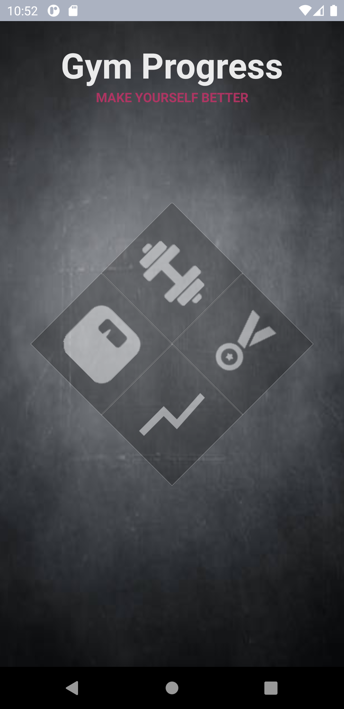
  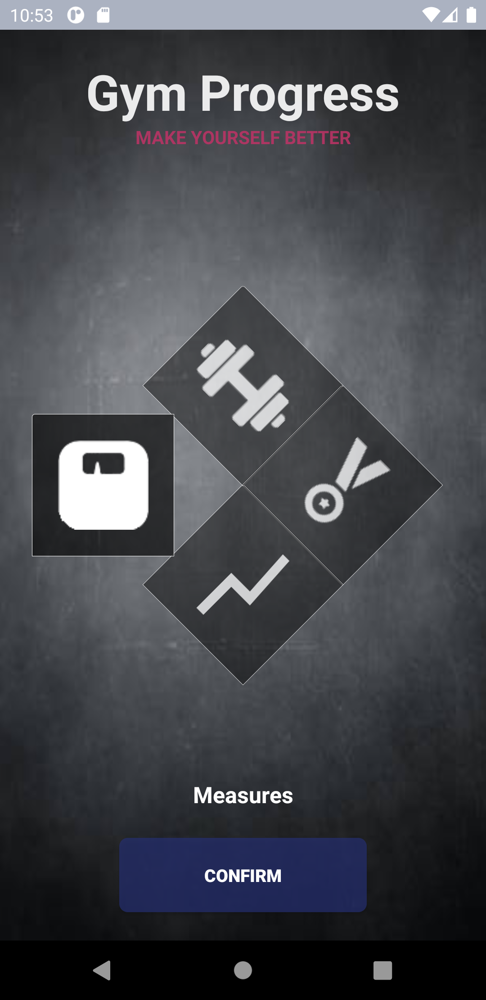
  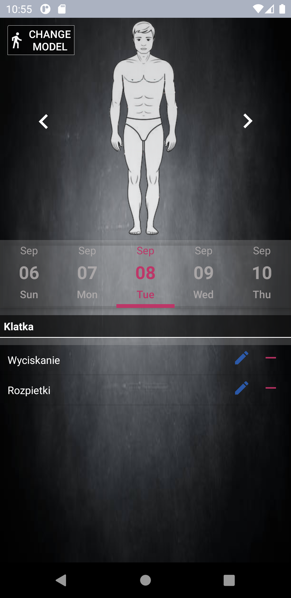
  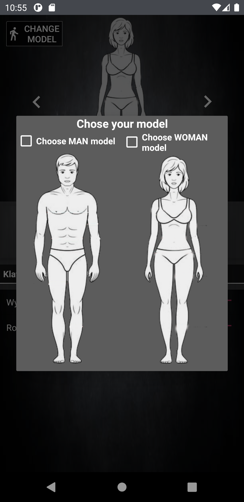
  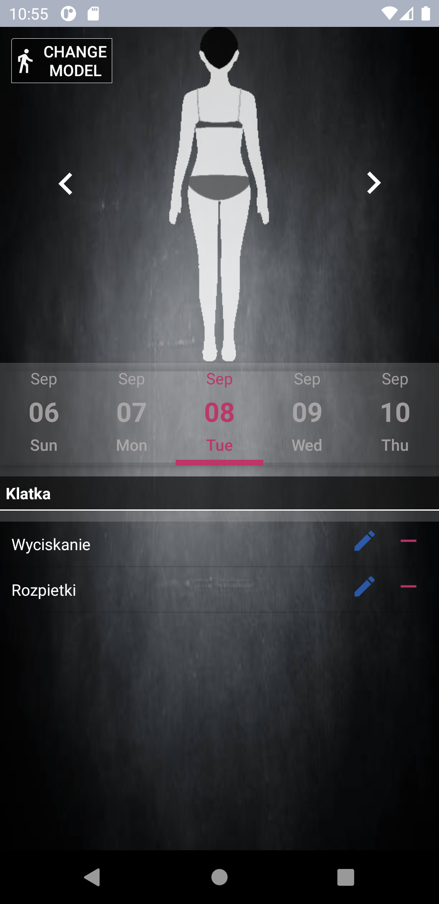
  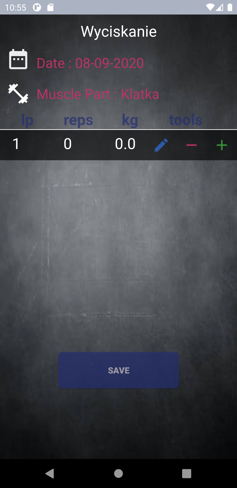
  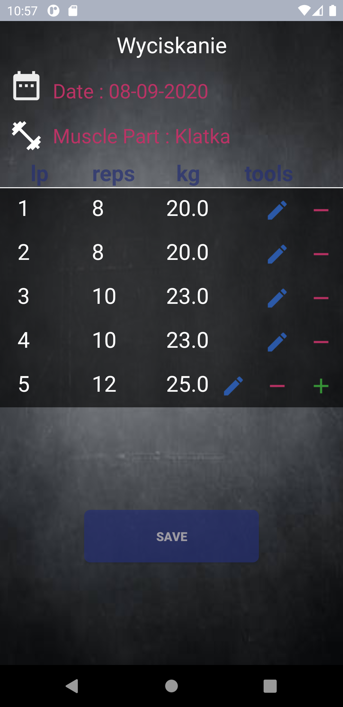
  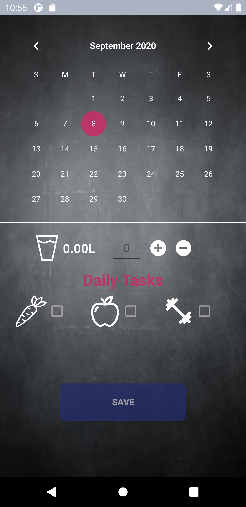
  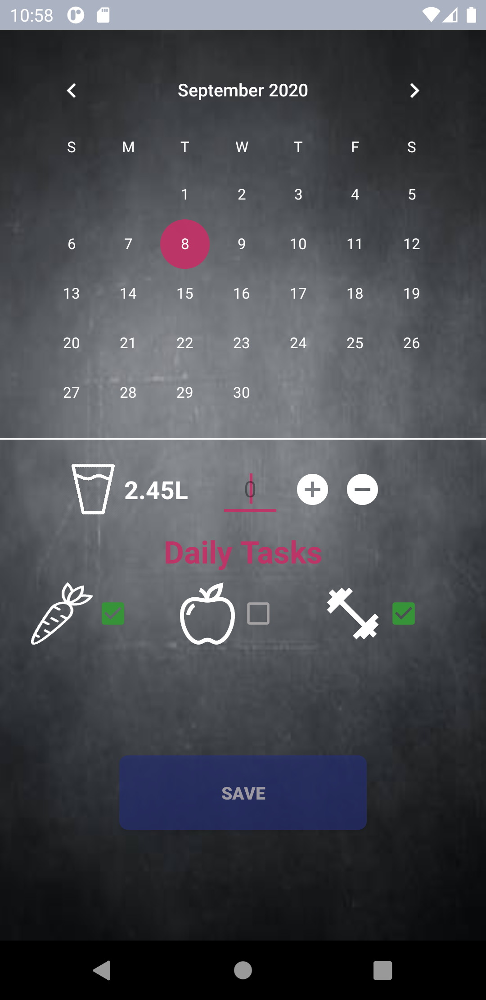
  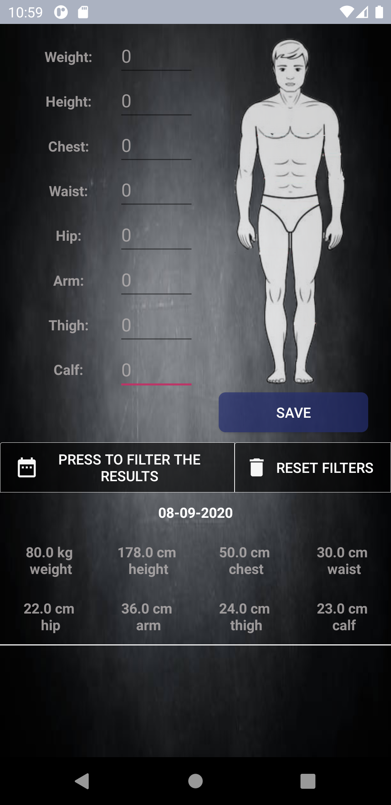
  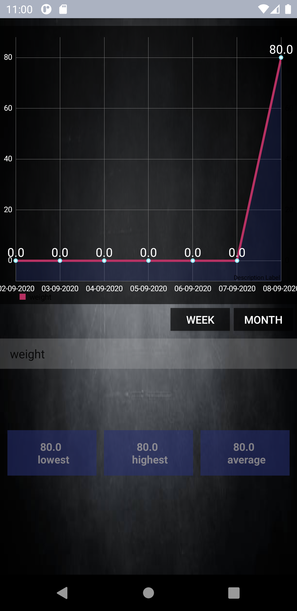

